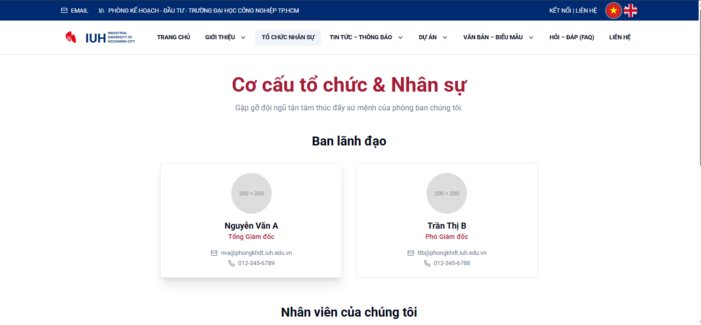

# Firebase Studio
This is a NextJS starter in Firebase Studio.

`Build website with AI`
This is a NextJS starter in Firebase Studio.

`Build website with AI`

To get started, take a look at src/app/page.tsx.

## Getting Started

First, run the development server:

```bash
npm install
```

Then, run the development server:

```bash
npm run dev
```

## Learn More

To learn more about Next.js, take a look at the following resources:

- [Next.js Documentation](https://nextjs.org/docs) - learn about Next.js features and API.
- [Learn Next.js](https://nextjs.org/learn) - an interactive Next.js tutorial.

You can check out [the Next.js GitHub repository](https://github.com/vercel/next.js/) - your feedback and contributions are welcome!

## Deploy on Vercel

The easiest way to deploy your Next.js app is to use the [Vercel Platform](https://vercel.com/new?utm_medium=default-template&filter=next.js&utm_source=create-next-app&utm_campaign=create-next-app-readme) from the creators of Next.js.

Check out our [Next.js deployment documentation](https://nextjs.org/docs/deployment) for more details.

## Images


To get started, take a look at src/app/page.tsx.bash
    npm install
    ```
2.  Run the development server:

    ```bash
    npm run dev


